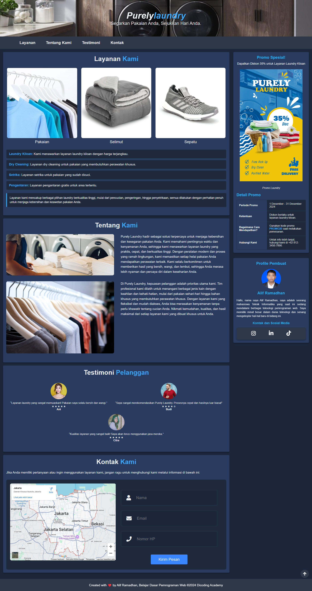

# 🌐 Website Laundry

Website ini dibuat untuk memenuhi **Tugas Akhir Dicoding** dalam kelas **Belajar Dasar Pemrograman Web**. Proyek ini bertujuan untuk membuat website laundry yang responsif dengan menggunakan **HTML Semantik**, **CSS Flexbox**, dan **JavaScript**.

---

## 🖼️ Tangkapan Layar

[](https://github.com/user-attachments/assets/4e2fee7f-9cae-453c-b90d-c2383a2077f3)
---

## ✨ **Fitur Utama**

- **Responsive Design**: Menggunakan CSS Flexbox dan Media Queries agar tampilan tetap rapi di semua perangkat.
- **Hamburger Menu**: Navigasi yang ramah perangkat mobile.
- **Scroll to Top**: Memudahkan pengguna untuk kembali ke bagian atas halaman.
- **Favicon Dinamis**: Favicon akan berubah ketika pengguna meninggalkan tab browser.

---

## 📚 **Teknologi yang Digunakan**

- **HTML5**: Untuk struktur halaman web dengan elemen semantik.
- **CSS3**: Untuk tampilan dan layout responsif menggunakan Flexbox dan Media Queries.
- **JavaScript**: Untuk fitur interaktif, seperti hamburger menu, scroll to top, dan favicon dinamis.

---

## 🚀 **Cara Menjalankan Proyek**

1. Clone repositori ke komputer Anda:
   ```
   git clone https://github.com/IndiluL/submission-dicoding-belajar-dasar-pemrograman-web.git
   ```
   
2. Masuk ke direktori proyek:
   ```
   cd submission-dicoding-belajar-dasar-pemrograman-web
   ```
   
3. Buka file index.html di browser untuk melihat website. Anda dapat melakukannya dengan:
   1. Klik dua kali pada file index.html di file explorer.
   2. Atau jalankan server lokal menggunakan ekstensi seperti Live Server di Visual Studio Code untuk pengalaman yang lebih baik.

4. Jika menggunakan Live Server:
   1. Install ekstensi Live Server di VS Code.
   2. Klik kanan pada file index.html, lalu pilih Open with Live Server.
